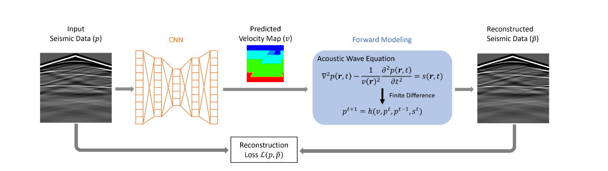
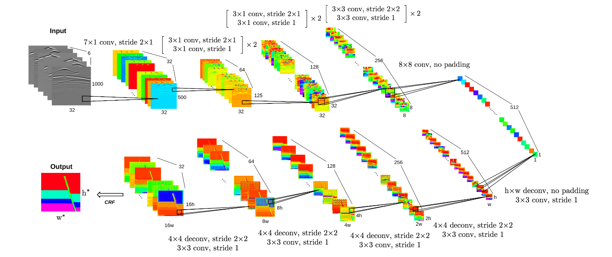

# UPFWI
my graduation project for unsupervised learning of Full-Waveform Inversion

## How to realize 
### 1.seis_data (CNN)--> velocity 
the NN architecture I chooose now is the InversionNet.
### 2.velocity (forward)--> seis_data_hat
the simulation programe I choose is deepwave

## the Architecture

## the reference
<a id="ref1">[1]</a> 
Wu, Yue, and Youzuo Lin. "InversionNet: An efficient and accurate data-driven full waveform inversion." IEEE Transactions on Computational Imaging 6 (2019): 419-433.

<a id="ref2">[2]</a> 
Jin, Peng. "UNSUPERVISED LEARNING OF FULL-WAVEFORM INVERSION: CONNECTING CNN AND PARTIAL DIFFERENTIAL EQUATION IN A LOOP"

<a id="ref3">[3]</a> 
Chengyuan Deng, Shihang Feng. "OpenFWI: Large-Scale Multi-Structural Benchmark Datasets for Seismic Full Waveform Inversion"

<a id="ref4">[4]</a> 
deepwave. "Wave propagation modules for PyTorch."